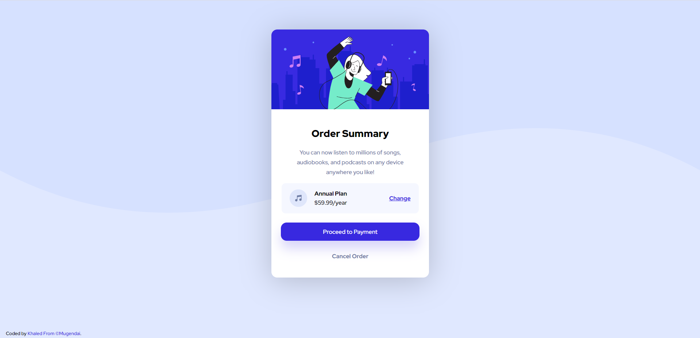

## Welcome! 👋

Thanks for checking out My front end Challenge I hope You like it


## Overview

### The challenge

Your challenge is to build out this order summary card component and get it looking as close to the design as possible.

In my coding I used HTML & SCSS. 

### Screenshot



This is a screenshot of the my front end page you can see it 

### Links 

- Solution URL: [Solution URL](https://www.frontendmentor.io/challenges/order-summary-component-QlPmajDUj)
- Live Site URL: [Live URL](-)   

## My Progress

### Building your project

- Semantic HTML5 markup
- SCSS
- Flexbox
- Responsed Mobile view

### What I learned 

I have improved my self in both scss and html I did an orgnized code that I hope you all can understand :)

Some HTML and scss code I'm proud of: 

```html
<svg class="order__icon">
     <use xlink:href="images/sprite.svg#icon-icon-music"></use>
</svg> 
```
```scss
@mixin size($breakpoint) {

    @if $breakpoint == phone {
        @media only screen and (max-width:23.4em /*375px*/) {
            @content;
        }
    }
    
}
```


## Author 

- Website - [Khaled](https://Mugendai.io)  

